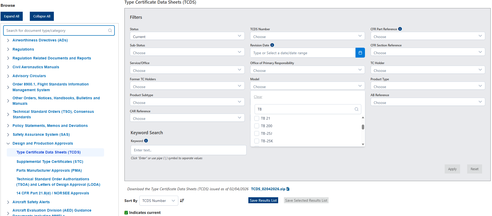
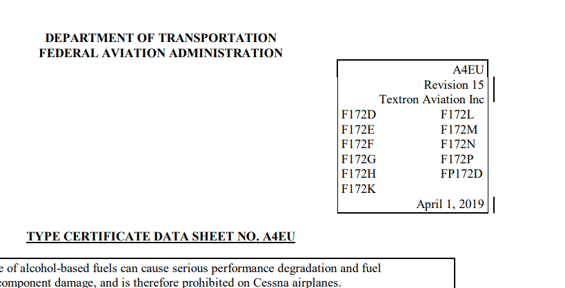
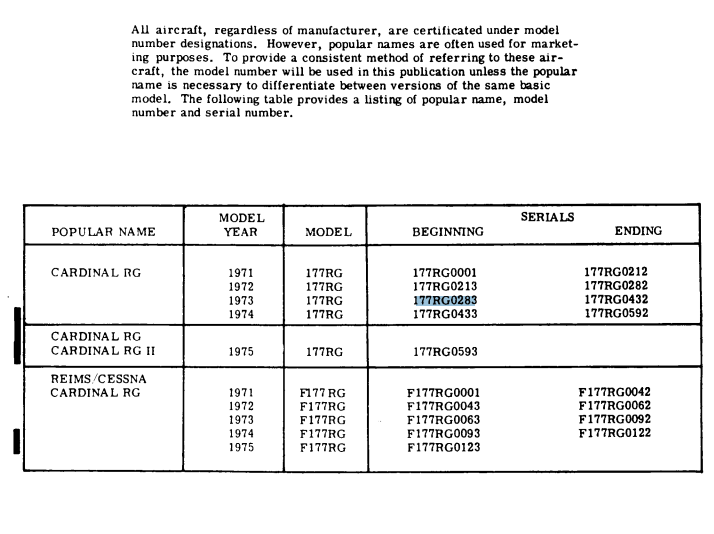
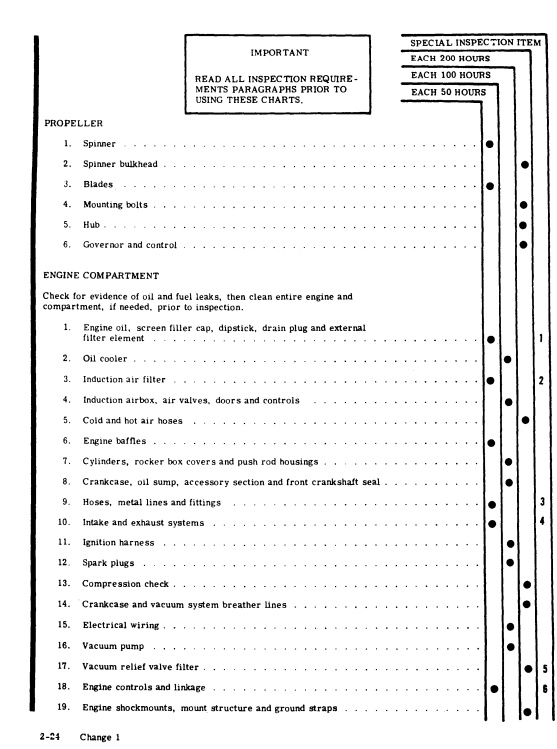
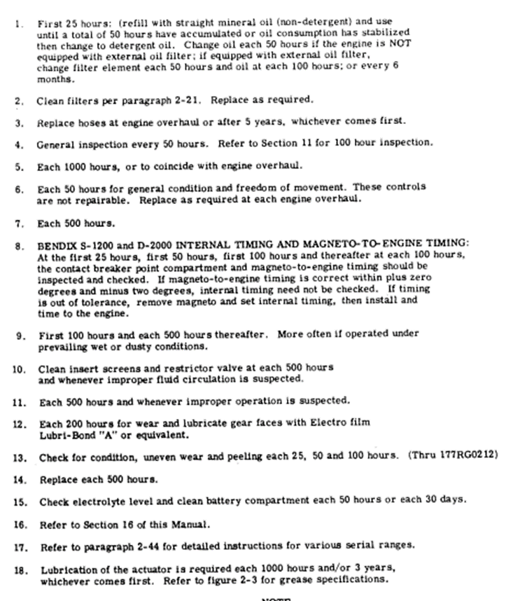

**Guía de Elaboración: Programa de Mantenimiento (AMP) bajo Parte-ML**

Este documento establece el procedimiento estándar para la redacción del Programa de Mantenimiento Aprobado (AMP) de aeronaves ligeras (Parte-ML) y su correspondiente Libro de Control de Aeronavegabilidad en Excel, partiendo de las Instrucciones para la Aeronavegabilidad Continuada (ICA) del Fabricante y los datos de los Certificados de Tipo (TCDS).

Para obtener la máxima calificación, sigue estrictamente las indicaciones de cada fase y asegúrate de que los datos del Word (Programa\_Mantenimiento\_ParteML2026.docx) y del Excel (Control de aeronavegabilidad.xlsx) coinciden exactamente.

**Fase 1: Identificación de la Aeronave, Base de Certificación y Uso (12 Puntos)**

**Objetivo:** Rellenar las Secciones 2, 3 y 6 del AMP (Word) y sus respectivos aparatados del Excel.

1. **Identificación modelo de motor y hélice (4 puntos):**

* Accede al sistema FAA DRS o al portal de EASA. Busca el TCDS (Type Certificate Data Sheet) filtrando por el Modelo exacto de la aeronave.

* Identifica correctamente los modelos exactos de aeronave,  motor y la hélice instalados a partir de la información del TCDS.

2. **Localización del TCDS (Célula, Motor y Hélice):**

   * Accede al sistema [FAA DRS](https://drs.faa.gov/browse) (Dynamic Regulatory System)  o al portal de EASA. Para aeronaves de diseño estadounidense (ej. Cessna, Piper), prioriza el TCDS de la FAA, ya que EASA suele convalidarlos.

   * Filtra por Model (ej. F172N) en lugar de fabricante.

   * Verifica la aplicabilidad cruzando el Número de Serie (S/N) de la aeronave con la efectividad declarada en el TCDS.

   * **Acción:** Registra **los números de TCDS aplicables** a la **célula**, el **motor** y la **hélice** en la **Sección 2 del AMP**.
   

El número de certificado de tipo es el que viene al principio de los docs, en la imagen el A4EU

3. **Controlar el Registro de revisiones (2 puntos):**

   * Rellena correctamente la Sección 3 del AMP, demostrando que comprendes la utilidad del registro de enmiendas y revisiones del documento.

4. **Identificar utilización de la aeronave (2 puntos):**

   * **Define e identifica correctamente en la Sección 6 la utilización esperada (horas/ciclos anuales) y la referencia a las instrucciones del documento donde viene indicado (pagina incluido)**

**Fase 2: Referenciación de Manuales de Aeronave y Motor (8 Puntos)**

**Recopilación de Datos de Mantenimiento (ICA)**

**Objetivo:** Rellenar la **Sección 7** del AMP.

1. **Identificación de Manuales Aplicables:**

   * Localiza el Aircraft Maintenance Manual (AMM) o Service Manual (SM) **específico para el modelo y año de fabricación** (ej. *Cardinal RG Series 1971 Thru 1975 Service Manual*).

   * **Acción:** Incluye en la **Sección 7** el **Título exacto**, ***Part Number*** (P/N) y el número de la última revisión y la fecha exacta de dicha revisión. Esta es la base normativa del AMP (ML.A.302(d)). Estos datos también alimentarán la columna Applicable ICA reference en el Excel.

Hay que asegurarse de que se corresponde con nuestro modelo de aeronave, NO deben guiarse solo por el nombre del manual, y deben comprobar la aplicabilidad en el contenido de los manuales. Generalmente nos guiaremos por el año de fabricación de nuestra aeronave

Ejemplo: Para el caso de la Cessna 177 RG que es del año 1974 y tiene un Serial Number 177RG0500, vemos que está entre las aeronaves contempladas para este manual:

**Fase 3: Programa Mínimo de Revisiones y Tareas de Servicio (15 Puntos)**

**Objetivo:** Rellenar la Sección 8.1 (y anexos) del AMP (Word) y la pestaña Tasks del Excel.

1. **Describir el programa mínimo de revisiones (15 puntos):**

   * Dirígete al Capítulo ATA 05 del AMM (o *Section 2: Inspection Requirements* en manuales Cessna antiguos).

   * Selecciona el programa de inspección aplicable al entorno operativo. Para Parte-ML (uso no comercial), **el estándar suele ser un programa de 50h, 100h, 200h y una inspección Anual** (que agrupa las anteriores).

   * Relaciona correctamente la inspección anual con las inspecciones por horas de vuelo.

   * **Acción en el Excel**: Traslada estas tareas a la pestaña Tasks, bloque Scheduled Test/Tasks. Indica los intervalos (FH, Ldg/Cycle, days).

   * Criterio clave: No confundas el listado de ítems de inspección individual (Inspection Charts) con el programa general de revisiones.

   * **Acción:** Vuelca estos datos en la **Sección 8.1**.

2. **Tareas de Lubricación y Limpieza** (Lubrication & Cleaning Tasks Items):

   * Localiza la sección de Servicing/Lubrication (típicamente ATA 12\) en el manual del fabricante.

   * Acción: Extrae e incluye explícitamente estas tareas en el AMP (apartado 8.2 inferior) y en el Excel, pestaña Tasks, bloque Lubrication & Cleaning Tasks.

3. **Aplicación de Tolerancias:**

   * Si **el manual del OEM no especifica tolerancias**, aplica las variaciones máximas genéricas permitidas (típicamente 10% o 1 mes, lo que ocurra primero, según las AMC de ML.A.302).

   * *Advertencia:* Las tolerancias **nunca** aplican a tareas obligatorias (ADs, ALIs, CMRs o LLPs).

**Fase 4: Inspecciones Especiales**

**Objetivo:** Rellenar la **Sección 8.2** del AMP.

1. **Extracción de Ítems Especiales:**

   * Ítems Especiales: Inspecciones con frecuencias distintas al programa base.

   * **Analiza las notas a pie de página en las tablas de inspección del OEM**. Aquí se detallan **tareas que no coinciden con la cadencia estándar** (ej. lubricación de actuadores cada 1000h o 3 años). En algunos manuales de aeronaves vienen contenidas en un apartado específico  del Capítulo ATA 05-20. En la mayoría  viene como una **Notación numérica** en el **Report de Revisión**, a la derecha, y luego en la Notas al final del documento, viene especificado.

   * **Acción: Regístralas en el Word (Sección 8.2) y en el Excel (Pestaña Tasks, bloque Special Points Test/Tasks).**  
     

Ejemplo: En el caso de Cessna 177RG son los puntos 1, 2, 3, 4, 5, 6 y así sucesivamente. 

Si vemos las notas al respecto:

Vemos que algunos son Items que tienen algún tipo de inspección (Checck) con una frecuencia distinta a la del mtto. Mínimo (50, 100 o 200h), y estos son los puntos especiales. 

Otros Items vienen indicados como “Replace” o “Overhaul”. Éstos ítems van a componentes con Vida límite, siguiente apartado.

**Fase 5:** **Identificación de Requerimientos de mantenimiento adicional y Limitaciones (ALIs) (12 Puntos) y Componentes con Vida Límite (LLP) y Overhaul (TBO)**

**Objetivo:** Rellenar la **Sección 10** del AMP.

1. **Mantenimiento debido a componentes con vida límite** 

   * Revisa las tareas marcadas como "Replace" (Descarte/LLP) o "Overhaul" en las ICA.

   * *Motores y Accesorios:* El TBO del motor rara vez viene en el AMM de la célula. Debes acudir a los Service Bulletins / Service Instructions del fabricante del motor (ej. Lycoming SI 1009 para TBO de motor y magnetos).

   * **Acción:** : Regístralas en el Word (Sección 10\) y en el Excel (Pestaña Life Limit Comp, bloque Life Limited Items).

   * *Nota Normativa:* Deja claro en el documento que los componentes LLP (*Hard Time*) no admiten extensión bajo ninguna circunstancia. Las extensiones de TBO deben justificarse en la Sección 9\.

   * Criterio clave: Diferencia claramente la columna Type of Task (OH, Discard, On Condition) en el Excel. Un ítem de descarte no es lo mismo que un Overhaul.

**Fase 6: Directivas de Aeronavegabilidad (ADs) Repetitivas**

**Objetivo:** Objetivo: Rellenar la Sección 10.3 (o 11\) del AMP (Word) y la pestaña AD's del Excel.

1. **Búsqueda de ADs:**

   * Consulta las bases de datos de la Autoridad de Diseño (FAA) y de EASA.

   * Ejecuta una búsqueda concurrente para la célula y el motor (appliances).

2. **Filtrado de ADs Repetitivas:**

   * Identifica únicamente aquellas ADs que requieran acciones recurrentes (busca términos como *repetitively*, *recurring inspection*, *at intervals not to exceed, There after*). **Las ADs de cumplimiento único ya ejecutadas no forman parte del AMP.**

   * Extrae su repetitividad real (no confundas el umbral inicial de cumplimiento con el intervalo repetitivo).

   * **Acción:** Incorpora las ADs aplicables en la **Sección 11**, separando Célula y Motor.

   * Criterio clave y diferenciador: Para obtener los 28 puntos, debes listar en el Excel las ADs que NO aplican y justificar el motivo en la columna "Remarcks" (ej. "N/A por número de serie" o "N/A por no tener el equipo instalado"), demostrando que has analizado el apartado Applicability.

**Fase 7: Libro de Control de Aeronavegabilidad Funcional (5 Puntos)**

**Objetivo:** Entregar el Excel de control operativo y sincronizado con el AMP.

* **Calificación global del Control de Aeronavegabilidad (5 puntos):**

  * **Integración del Flight Log:** La pestaña **Flight Log** debe sumar correctamente las "Horas de Vuelo Acumuladas", "Nº de Vuelos (Ciclos) Acumulados" y "Aterrizajes Totales".

  * **Actualización Automática:** El Excel debe actualizar todos los potenciales (*Next due* y *to go*) en las pestañas Tasks, Life Limit Comp y AD's alimentándose directamente de los acumulados de la pestaña Flight Log.

  * El libro debe ser completamente funcional, coherente con lo redactado en el Word y no contener errores de cálculo u omisiones estructurales de celdas.